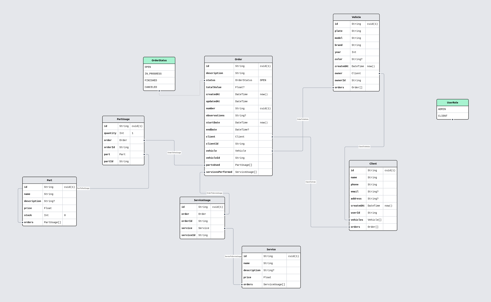

# Dados do Ecossistema PitStop

## Diagrama Entidade-Relacionamento (DER)

O diagrama acima representa a modelagem conceitual do domínio de dados do PitStop. Ele descreve as entidades principais do sistema, seus atributos essenciais e como se relacionam dentro do banco PostgreSQL operado pelos serviços Backend e Autenticação.

### Como interpretar o DER

- **Entidades** (retângulos) sintetizam objetos centrais do domínio, como clientes, veículos, ordens de serviço e usuários autenticados.
- **Relacionamentos** (losangos ou conexões) explicam como as entidades interagem. Por exemplo, um cliente pode possuir vários veículos, e cada ordem de serviço associa um veículo a intervenções técnicas.
- **Cardinalidades** indicam restrições de quantidade, garantindo regras como "um veículo pertence a exatamente um cliente" ou "uma ordem pode listar várias peças e serviços".
