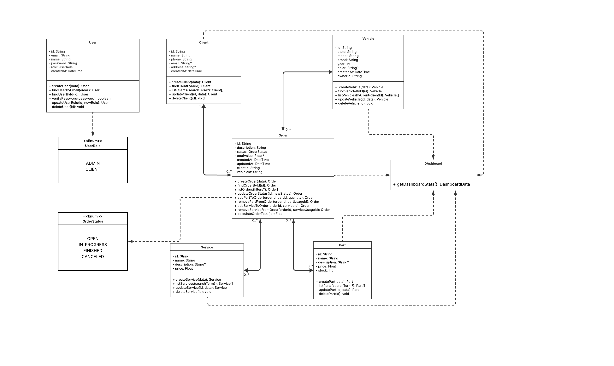

 Diagrama de Classes UML

O diagrama abaixo representa a estrutura estática do sistema PitStop, mostrando as principais classes, seus atributos, métodos e os relacionamentos entre elas, conforme a notação UML.

