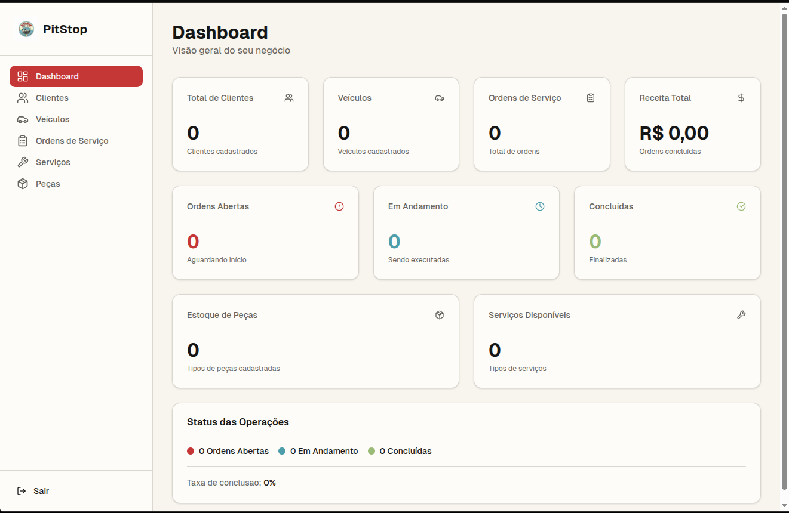

# Protótipo V0 - Versão Inicial

Abaixo estão as telas principais que compõem a versão 0 (V0) do protótipo, foi feito utilizando o V0 do Vercel 

### Tela de Login

...

### dashboard

...

### Tela de cliente

...

### Tela de Ordem de Serviço

...

### Tela de Peças

...

### Tela de Serviços

...

### Tela de Veiculos

...